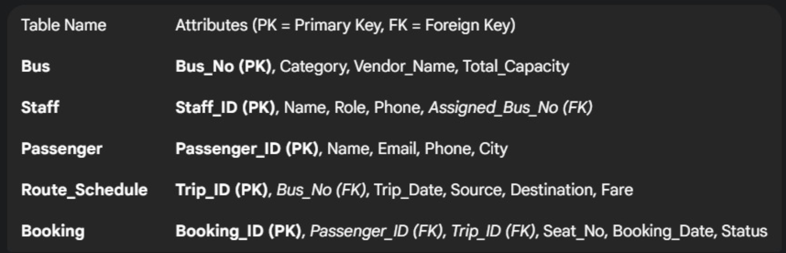
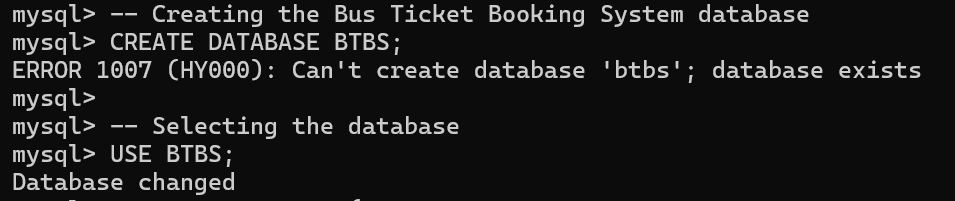
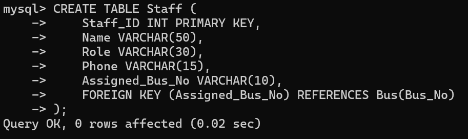
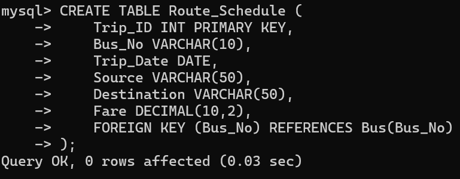
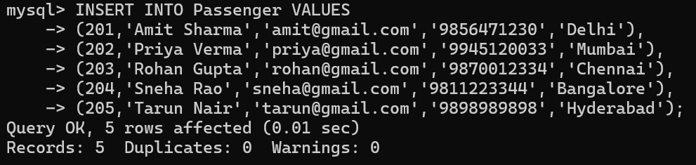

Bus Ticket Booking System (BTBS)

Beginner DBMS project using SQL

--------------------------------------------------

About:
This project is a simple implementation of a Bus Ticket Booking System using SQL. 
It manages buses, passengers, staff, routes, and bookings in a structured database.

--------------------------------------------------

Features:
- Stores bus details
- Manages passenger information
- Handles ticket booking
- Tracks routes and schedules

--------------------------------------------------

Tables Used:
- Bus
- Staff
- Passenger
- Route_Schedule
- Booking

--------------------------------------------------

Project Files:
- btbs.sql → contains all SQL code (tables + data + queries)
- screenshots/ → contains output images
- BTBS_Report.pdf → full project report

--------------------------------------------------

Sample Queries:
SELECT * FROM Bus;

SELECT * FROM Passenger WHERE City = 'Delhi';

SELECT * FROM Booking;

--------------------------------------------------

How to Run:
1. Open MySQL
2. Run:
   SOURCE btbs.sql;
3. Execute queries

--------------------------------------------------

Screenshots:

--------------------------------------------------

Project Report:
[View Report](BTBS_Report.pdf)

--------------------------------------------------

What I Learned:
- Basics of SQL
- Table creation
- Data insertion
- Writing queries

--------------------------------------------------

Note:
This project was created for learning and practice.
